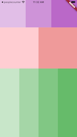

# Exercício 1

Esse exercício tem como intuíto exercitar questão de posicionamento de Widgets.

## Instruções
- Deverá ser criado uma tela, semelhante a figura a seguir:

### Porcentagem das linhas
- Primeira linha usa 20% da altura da tela
- Segunda linha usa 30% da altura da tela
- Terceira linha usa 40% da altura da tela

### Cores das linhas
- Colors.purple[100], Colors.purple[200], Colors.purple[300]
- Colors.red[100], Colors.red[200]
- Colors.green[100], Colors.green[200], Colors.green[300], Colors.green[400]
