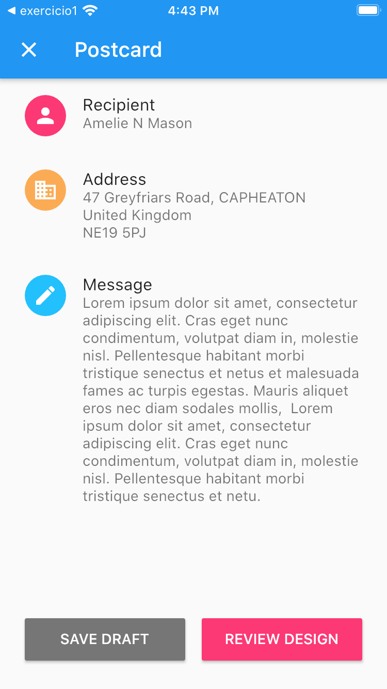

# Exercício 2

Esse exercício tem como intuíto exercitar questão de posicionamento de Widgets.

## Instruções
- Deverá ser criado uma tela, semelhante a figura a seguir:

### Cores e ícones

Item 1
- Cor: Color(0xFFFC3875)
- Icone: Icons.person

Item 2
- Cor: Color(0xFFFCAB55)
- Icone: Icons.business

Item 3
- Cor: Color(0xFF22C0FC)
- Icone: Icons.edit

Botão "Save"
- Cor: Color(0xFF767676)

Botão "Review"
- Cor: Color(0xFFFC3875)
