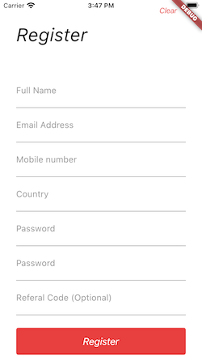

# exercicio3

A new Flutter application.

## Instruções
Deverá ser criado uma tela, semelhante a figura a seguir:

Faremos uma validação simples de formulário.

O botão 'Register', deverá apresentar no console as informações inseridas.

Cada campo de informação, deverá ter o teclado mais adequado.

## Figma File

https://www.figma.com/file/PNX38OlBkvOQN4ZWY6EPJk/marketplace-app-callmedesigner-Copy?node-id=0%3A1