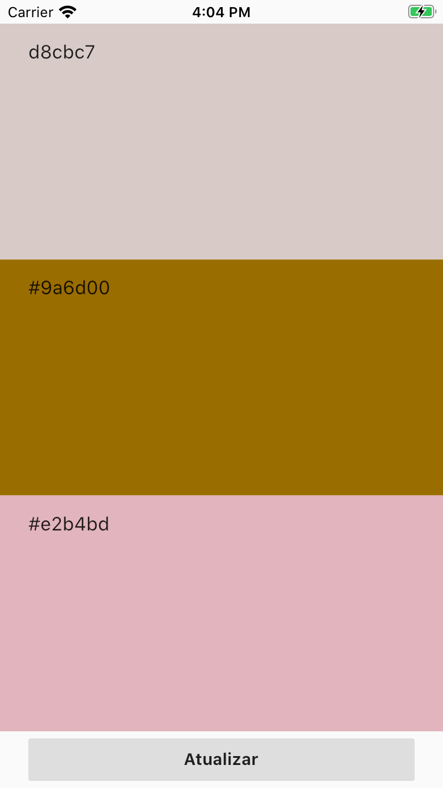

# Exercício 4

Esse exercício tem como intuíto exercitar o uso de Stateful widgets e de entradas de dados.

## Instruções

- Criar um simulador de paleta de cores, contendo 3 entradas. Onde o usuario poderá digitar o codigo hex das cores e após pressionar o botao "atualizar" as cores dos widget são atualizadas.
- Deverá ser criado uma tela, semelhante a figura a seguir:
- 

### Convertendo código hex para cor

Para auxiliar na conversão das entradas para as cores desejadas, foi criado este utils. para usa-lo basta criar um arquivo `color_utils.dart` e colar o conteúdo abaixo.

```
  import 'dart:ui';

  class ColorUtils {
    static Color fromHex(String hexCode) {
      final colorHexRegex = RegExp('(#{0,1})([0-9a-fA-F]{6})');

      if (!colorHexRegex.hasMatch(hexCode)) {
        throw Exception('"$hexCode" is not a valid color code');
      }
      hexCode = hexCode.replaceFirst('#', '0');

      return Color(0xff000000 + int.parse(hexCode, radix: 16));
    }
  }
```
