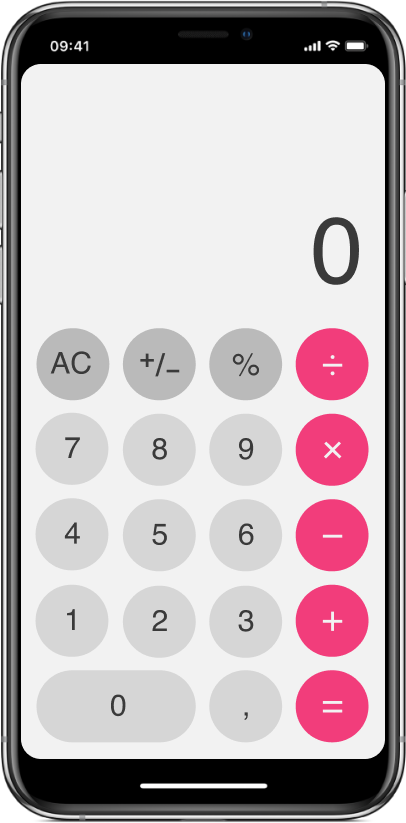

# Exercício 6

Esse exercício tem como intuít exercitar programação com Flutter.

## Instruções

- Baseada na calculadora padrão do iOS, essa aplicação executa as seguintes funções: `soma`, `subtração`, `multiplicação`, `divisão`, `porcentagem` e `+/-`. 
- Deverá ser criado uma tela semelhante a figura a seguir:

