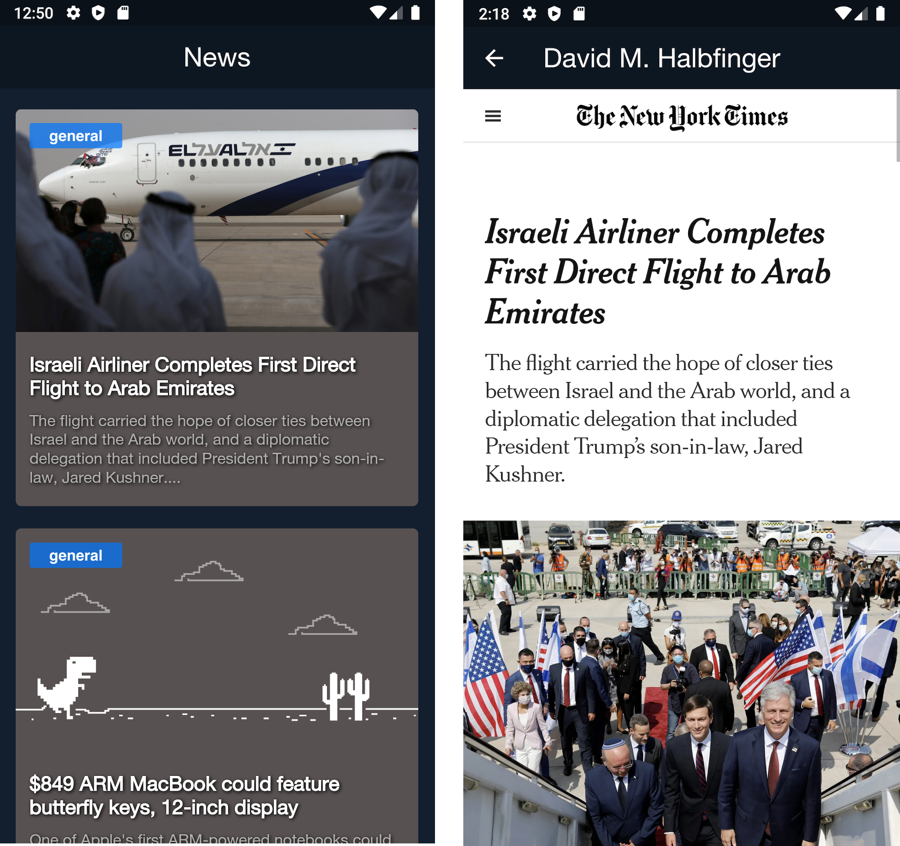

# Exercício 7

Devido a pandemia, Godinez não tem conseguido ler seu jornal matinal.
Para inovarmos e fazer um app revolucionário, iremos extrair dados de uma API pública de notícias e montar um feed. 
Quando clicado na notícia, direcionaremos o usuário para uma WebView.

- Deverão ser criadas as telass semelhante a figura a seguir:

