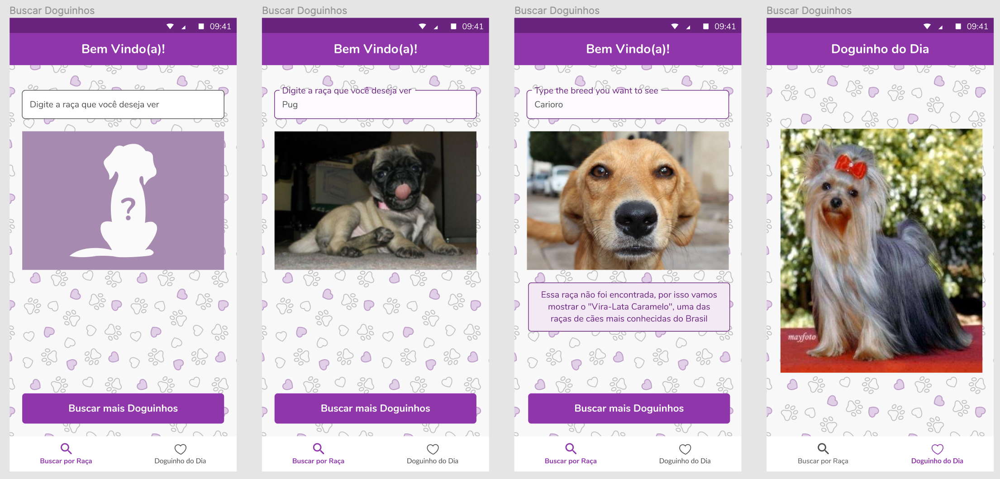

# Exercício 9

Utilizaremos a API abaixo:

https://dog.ceo/dog-api/

Deverão ser criadas duas telas:

- A primeira tela será para busca de cachorros por raça
- A segunda tela mostrará uma foto de um cachorro da raça digitada, caso encontrado, e terá um botão para carregar outra imagem da mesma raça.
- A tela mostrará o nosso clássico vira-lata caramelo e uma mensagem de erro, caso não encontre nada com o que o usuário digitou.
- A segunda tela, acessada por meio do menu inferior, buscará uma imagem aleatória da API fornecida:

- Figma File: https://www.figma.com/file/0EuWq5KOqS4rNSgHcaW5a9/Doguinhos?node-id=0%3A1
